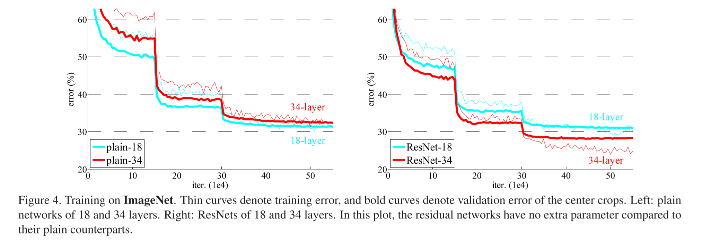
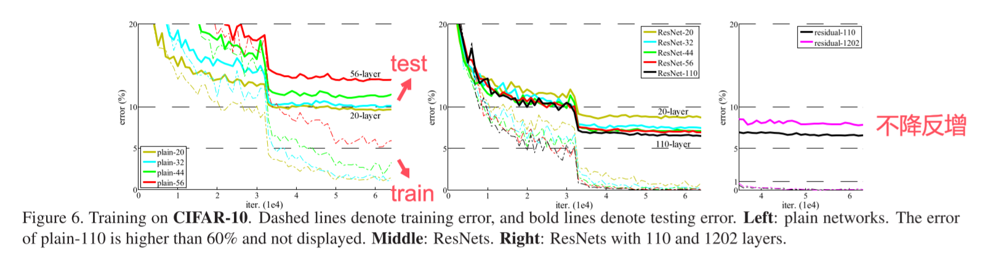

# Deep Residual Learning for Image Recognition

## 1. 文章想要解决的问题

较深的神经网络难以训练。也就是深度神经网络的退化问题。

CNN整合了低中高不同层次的特征，特征的层次可以通过加深网络来丰富。因此在构建卷积网络时，网络的深度越高，可抽取的特征层次也就越丰富。但是较深的网络不一定会带来更好的表现。例如：

该现象会由什么原因造成。

1. 首先排除过拟合，因为过拟合是让网络在训练集上表现的更好而测试集更差。它的表现是高方差低偏差，训练集误差小而测试集误差大。
2. 梯度消失/爆炸。梯度消失/爆炸是神经网络在反向传播的时候，反向连乘的梯度小于1（或者大于1），导致连乘次数变多以后（层次加深），传回首层的梯度过小甚至为0（过大或无穷大）。 这个问题是从一开始就阻碍收敛，目前很大程度上可以通过normalized initialization(标准初始化？)和intermediate normalization layers(中间的正则化层，BN层)规整数据分布来解决该问题。(SGD+反向传播)
3. 退化问题。随着网络深度的增加，精度会逐渐饱和，然后迅速退化。

本文提出了一个残差学习框架(residual learning framework)来简化训练。

## 2. 本文采用的新知识

提出了一个残差学习框架(residual learning framework)。如果添加的层可以构造为恒等映射(identity mapping)，那么较深的模型的训练误差应该不大于较浅的模型。

通过残差学习来重构模型，进行预处理，如果恒等映射是最优的，求解器可以简单的将多个非线性层的权值趋近于零来毕竟恒等映射。

### 2.1. 残差学习 

图为残差网络的一个"shortcut connection"(快捷连接)结构。网络不在直接拟合原先的映射，而是拟合残差映射。将所需的底层映射表示为$H(x)$，让原本叠加的非线性层拟合另一个映射$F(x)=H(x)-x$，则原始映射被重新定义为$F(x)+x$。假设它相比于原始的、未引用的映射更容易去优化残差映射。再极端情况下，如果恒等映射是最优的，它更容易推动残差为零而不是通过堆叠非线性层来拟合恒等映射。【意思是$F(x)$是残差？如果恒等映射$x=x$是最优的，那么相比于以前的推动$F(x)=x$，推动$F(x)=0$而使得$H(x)=x$更容易】

在真实案例中，恒等映射不一定是最优的，换种说法。如果最优函数更接近恒等映射而非零映射，求解器会更容易参考恒等映射来找到扰动。

### 2.2. 快捷的恒等映射

对每几个堆叠的层采用残差学习。残差块如Figure 2所示。在本文中，考虑将building block(构建块)定义为：
$$
\begin{equation}
\boldsymbol{y}=F(\boldsymbol{x}, \{W_i\})+\boldsymbol{x} \tag{1}
\end{equation}
$$
其中$x,y$分别是层输入和输出的向量。函数$F(x,\{W_i\})$表示要学习的残差映射。例如Fig. 2中含有两个层，$F=W_2\sigma(W_1\boldsymbol{x})$，$\sigma$是ReLU，且偏差被省略。快捷连接既没有引入额外的参数，也没有引入计算复杂度，这是非常重要的。

在式(1)中，$\boldsymbol{x}$和$F$在维度上是相同的。如果情况不同（例如：更改输入/输出的通道），可以通过快捷连接执行线性投影$W_s$来匹配尺寸：
$$
\begin{equation}
\boldsymbol{y}=F(\boldsymbol{x}, \{W_i\})+W_s\boldsymbol{x} \tag{2}
\end{equation}
$$
也可以在式(1)使用一个矩阵$W_s$，但是本文通过实验证明恒等映射是足以解决退化问题的，并且足够经济，因此$W_s$仅在匹配尺寸时使用。

残差函数$F$的形式是灵活的。$F$可以有很多层，如果$F$只有一个层，式(1)类似于线性层$\boldsymbol{y}=W_1\boldsymbol{x}+\boldsymbol{x}$，这个结构没有优势。

### 2.3. 网络架构

1. 普通网络（也就是不含残差项的网络）。学自VGG，卷积层大多使用3x3的filter，并遵循两个规则：1）输出的特征图尺寸相同时，layer有相同的数量的filter。2）特征图大小减半，则filter数量翻倍，以此保证每层的时间复杂度。
2. 残差网络。基于普通网络，使用快捷连接。当输入输出具有相同维度时，可以直接使用恒等快捷方式（实线）。当维度增加时（虚线）有两个选项1）通过补0增加维度使得其继续执行恒等映射。2）式(2)中的投影快捷方式基于1x1卷积匹配维度。 当快捷连接跨越两种大小的特征图时，两种选项都以stride = 2来执行。

### 2.4. 执行方式

图像：大小为224x224，在图片中裁剪而来

图像增强：使用

batch normalization：在卷积层和激活函数之间

初始化：初始化权重为0？学自[Delving deep into rectifiers: Surpassing human-level performance on imagenet classification.](https://openaccess.thecvf.com/content_iccv_2015/papers/He_Delving_Deep_into_ICCV_2015_paper.pdf)

优化器（是不是叫优化器？）：SGD，mini-batch为256

学习率（lr）：从0.1开始，当误差平稳时除以10

weight decay：0.001

momentum：0.9

dropout：未使用

## 3. 实验设计

### 3.1. ImageNet Classification

基于ImageNet 2012数据集。

#### 3.1.1. 普通网络vs残差网络

Fig. 4中细线表示训练集误差，粗线表示验证集误差。左：普通网络(18/34层)，右：残差网络(18/34层)。所有快捷连接使用恒等映射，对增加的维度使用零填充（A选项）。相对于普通网络没有参数增加。

在这里观察到了退化问题，普通网络随着深度增加，误差率上升。具体原因不知，但不太可能是因为梯度消失，因为使用了BN。推测是深的普通网络可能指数级的降低收敛速度，这会影响到训练集误差的降低。

通过Tab. 2和Fig 4观察到三个主要结果：

1. 残差学习区别于普通网络，34层的ResNet比18层的ResNet更好(2.8%)。而且这种优势不仅表现在训练集上，验证集上误差也有所降低。这表明了退化问题得到了一定的解决。
2. 根据Tab. 2对比，证明残差学习在深度网络上有效。
3. 18层的网络都很有效，但是ResNet的收敛速度更快。ResNet在早期提供更快的收敛速度。

#### 3.1.2. 恒等捷径vs投影捷径

投影快捷方式有三种：

​	A）用零填充方式增加维度，并且所有的快捷连接都是无参数的。

​	B）用投影快捷方式增加维度，其他快捷方式都是恒等连接

​	C）所有的快捷连接都是恒等连接

三种方式对比：

通过对比，A/B/C三种方式都可以有效解决退化问题，但是C>B>A，但是C引入了额外的参数。三者的微小差异表明投影方式不是解决退化问题的关键。

#### 3.1.3. 更深的瓶颈架构(Bottleneck Architectures)

左：ResNet-34。右：ResNet50/101/152

1x1层用于减少然后恢复维度，bottleneck中3x3层使用更小的输入/输出维度。

无新增参数的恒等快捷连接对于瓶颈架构十分重要，由于快捷方式连接到两个更高的维度，恒等快捷方式替换为投影会导致时间复杂度和模型大小加倍。所以恒等快捷连接可以为瓶颈架构设计提供更有效的模型。

#### 3.1.5. 和其他先进技术的对比

34层的ResNet相比于其他网络已经足够，随着深度增加，精度还会增加。

### 3.2. CIFAR-10 分析

weight decay：0.0001

momentum：0.9

权重初始化：有

BN：有

dropout：无

minibatch：128

GPU：两个

learning rate：0.1，在32k和48k次迭代时学习率除以10，在64k次迭代时终止。

数据增强：有，在边缘增加4像素，32x32从填充后的图像或其翻转中随机切割

input：32x32  images（减去每个像素的平均值？这是在做什么？）

第一层是3x3卷积层，对于尺寸分别是{32, 16, 8}的特征图分别使用filter{16, 32, 64}，降采样为步长为2的卷积，网络以全局的均值池化终止，全连接层10，SoftMax。

在该数据集中，网络均采用A策略恒等映射。

这个1000层的效果更差的原因可能是因为过拟合，因为数据集并不是特别大，并且实验过程中只简单的使用了正则化，并没有使用maxout/dropout等。

#### 3.2.1. 网络层响应分析

残差函数的响应强度（这种响应是每个3x3卷积层的输出，在BN之后，nonlinearity之前），残差函数通常比非残差函数更接近于零，更深的ResNet则具有更小的响应。当有更多层是，ResNet的一个单独层更倾向于少量修改信号。

### 3.3. PASCAL & MS COCO

泛化能力很强。

## 4. 本文贡献

通过在ImageNet数据集的综合实验，证明了1）当深度增加时，极深的残差网络很容易优化，而普通网络表现出较高的训练误差。2）深度残差网络可以轻松的在增加深度时获取更好的精度，产生的结果比以前的网络好的多。

提出了Residual Networks(ResNet)。精度比以往的网络更好，泛化性也良好。

## 5. 论文相关资源

### 5.1. [ImageNet](https://image-net.org/) 

需要申请下载。

包含1000个类。128万张训练图像，5万张验证图像，10万张测试图像。

### 5.2. [CIFAR-10](http://www.cs.toronto.edu/~kriz/cifar.html)

训练集：50K，测试集10K。分10类。

###  5.3. [ResNet](https://github.com/KaimingHe/deep-residual-networks)

## 6. 相关论文

[1]. [ImageNet Classification with Deep Convolutional Neural Networks](http://papers.nips.cc/paper/4824-imagenet-classification-with-deep-convolutional-neural-networks.pdf)

[2]. [Batch Normalization](http://arxiv.org/pdf/1502.03167v3.pdf)

[3]. [VGG](http://arxiv.org/pdf/1409.1556.pdf)

## 7. 不懂之处

