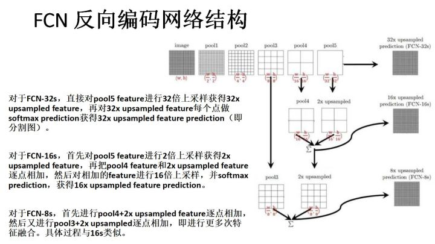

# Fully Convolutional Networks for Semantic Segmentation

为什么是“全卷积“？因为该文将传统CNN后面的全连接层转化为了1x1的卷积层。这样避免了Flatten损失的二维信息。

## 1. 文章想要解决的问题

证明卷积网络经过端到端、像素到像素的训练，在语义分割方面超过了当时的水平。

语义分割方面，卷积网络带来的进步是对每个像素做预测。以前的将卷积网络用于语义分割，每个像素是用其封闭对象或区域的类来标记，但是这些方法有缺点。（封闭对象或区域是指像素周围的固定大小的区域吗？）

语义分割的一些问题：

深层特征层次以非线性的局部到全局的金字塔方式结合位置和语义。

## 2. 本文采用的新知识

全卷积网络

较高层中的位置对应路径连接的原图像中的位置称为感受野。（卷积神经网络每一层输出的特征图上的像素点在**输入图片**上映射的区域大小）

卷积是建立在平移不变性上的，他们的基本组件（卷积、池化、激活函数）都在局部输入区域上进行，并且仅依赖于相对空间坐标。

<image src="../image/2_Fully Convolutional Networks for Semantic Segmentation/convert_1.png">

<image src="../image/2_Fully Convolutional Networks for Semantic Segmentation/convert_2.png">

【第一个卷积是在计算感受野，但是怎么卷的不太明白。第二个应该是步长和卷积核大小的计算规则，也没太明白。】

一般的深度网络计算一般的非线性函数，只有这种形式的层的网络计算非线性滤波器，被称为全卷积神经网络或者深度滤波器。

由FCN组成的实值损失函数定义了一个任务。如果损失函数是最后一层空间维度的和，$l(\boldsymbol{x};\theta)=\sum_{ij}l'(\boldsymbol{x}_{ij};\theta)$，他的梯度将是其每个空间分量的梯度的总和。因此，在整个图像上计算的$l$上的随机梯度下降与将所有最后一层的感受野作为一个小批量的随机梯度下降$l'$相同。

当感受野明显重叠时，前馈计算和反向传播在整个图像上逐层计算会比独立的逐批量更有效。

### 2.1. 为稠密预测调整分类器

典型的分类神经网络，在全连接层具有固定的维度而丢弃了空间坐标。然而，这些全连接层也可以被视为具有覆盖其整个输入区域的核的卷积。该网络接受任意大小的输入和输出分类图。

虽然得到的映射图等价于对特定输入块上原始网络的评估。**但是这些块的重叠区域上的计算是高度分散的**

每一个输出单元有相应的ground truth。前馈和反向传播都很直接。充分利用内在计算效率。

#### 2.1.1. Shift-and-stitch is filter rarefaction

文章有所介绍，但是最后选用了更为高效的上采样。

[SAS的具体介绍](https://blog.csdn.net/qinghuaci666/article/details/80833866)

#### 2.1.2. Upsampling is backwards strided convolution

文章上采样部分采用转置卷积，全卷积网络基本结构即“卷积-反卷积-分类器”，通过卷积提取位置信息以及语义信息，通过反卷积上采样至原图像大小，再加上深层特征和浅层特征的融合，达到语义分割的目的。

传统的网络是subsampling的，对应的输出尺寸会降低。upsampling的意义在于将小尺寸的高位feature map恢复回去，方便去做pixelwise prediction，来获取每个像素的分类信息。

#### 2.1.3. Patchwise training is loss sampling

没看懂，但是好像是为了抛弃冗余信息，不使用原始图片，而使用其重要部分进行训练。但是本文没使用patchwise training

### 2.2. 分割架构（ Segmentation Architecture）

在PASCAL VOC 2011分割挑战上训练和验证

用每个像素logistic loss训练并通过联合上的平均像素交集的标准度量进行验证，其中包括所有类的平均值，包括背景。训练忽略了在ground truth中被掩盖的（如模糊、困难）像素。

第一行：FCN-32，步长32，这是简单的net

第二行：FCN-16，步长16，结合最后一层和pool4.

第三行：FCN-8，步长8，用pool3提供额外的信息补充精度

我理解为：当网络越深，感受野越大，看的范围越大，但是细节越少，所以用较浅的层的精细的信息来弥补细节。

经查询，三个的不同Stride的原理为：

#### 2.2.1. 从分类器到密集FCN

首先选择了VGG-16，使用GoogLeNet的最后的损失层，并且丢弃最终的平均池化层来提高性能。丢弃最后的全连接层，变为卷积层。增加了一个通道维度21的1x1卷积来预测每个粗略输出位置的每个PASCAL类（包括背景）的分数，然后是一个反卷积层用于将粗略输出以双线性上采样转换到像素密集输出。

#### 2.2.2. Combining what and where

即上图。

## 3. 实验设计

## 4. 本文贡献

证明卷积网络经过端到端、像素到像素的训练，在语义分割方面超过了当时的水平。

本文主要是构建“全卷积“接受任意大小的输入并产生相应大小的推理、学习的输出（这种输出应该是指与原图片大小一致的像素分类结果）。

文章定义并详细描述了全卷积网络空间，解释了全卷积网络在稠密预测任务中的应用，并与以前的模型建立了连接（用不同的模型提取图片特征？）。

然后定义了一个skip架构，该架构将来自深层的语义信息和来自浅层的appearance information（外表信息？）来生成准确详细的语义分割。

FCN是第一个使用像素预测以及监督预训练的。学习和推理都是密集的一次执行整个图像的前馈计算和反向传播的。

网络内上采样层通过==子采样池化==（这是什么？）来实现网络中的像素预测和学习。

为了解决深层特征层次以非线性的局部到全局的金字塔方式结合位置和语义。本文定义了一个skip架构，去结合来自深层的粗糙的语义信息和来自浅层的表征信息。（Fig. 3）

## 5. 论文相关资源

## 6. 相关论文

## 7. 不懂之处